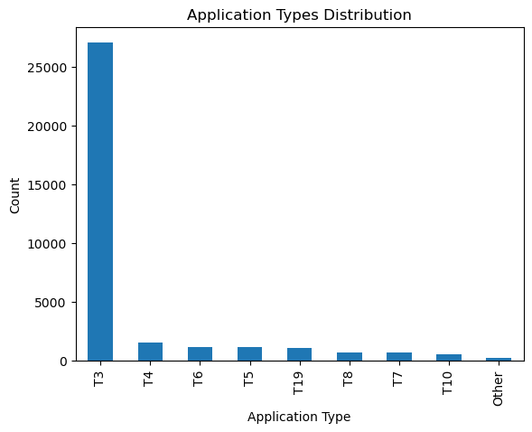
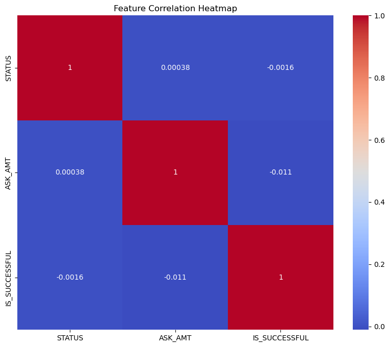

---

# Neural Network Model Report for AlphabetSoupCharity_Optimization

## Overview of the Analysis
The primary objective of this analysis is to predict whether applicants will be successful if funded by Alphabet Soup. The data is sourced from the `charity_data.csv` file, which includes information about various organizations' applications.

## Results

### Data Preprocessing

- **What variable(s) are the target(s) for your model?** 
    - The target variable for our model is "IS_SUCCESSFUL", indicating the success of the application.

- **What variable(s) are the features for your model?** 
    - The features include all columns except "EIN", "NAME", and "IS_SUCCESSFUL". This includes data about application type, classification, and other related details.

- **What variable(s) should be removed from the input data because they are neither targets nor features?** 
    - The variables "EIN" and "NAME" were removed since they are identifiers and provide no relevant information for predicting the outcome.

### Compiling, Training, and Evaluating the Model

- **How many neurons, layers, and activation functions did you select for your neural network model, and why?** 
    - **Neurons**: The first and second hidden layers each have twice the number of neurons as there are features. The choice is to give the model complexity, allowing it to capture underlying patterns in the data.
    - **Layers**: There are 2 hidden layers and an output layer in our model. Multiple layers allow for deeper understanding and capturing non-linear patterns.
    - **Activation Functions**: For the hidden layers, the "ReLU" activation function was chosen due to its efficiency in handling non-linear data. The output layer uses the "sigmoid" activation function, suitable for binary classification problems.

- **Were you able to achieve the target model performance?** 
    - The model achieved an accuracy of 72.61%, which may or may not meet the desired threshold based on specific use-case requirements.

- **What steps did you take in your attempts to increase model performance?** 
    - Features were scaled using `StandardScaler` to normalize the input data.
    - Categorical variables were encoded using `pd.get_dummies`.
    - Less frequent categories in features like "APPLICATION_TYPE" and "CLASSIFICATION" were binned into a common "Other" category, reducing noise and potential overfitting.

![Feature Importance (Image/feature_importance.png)

### Summary
The deep learning model has shown reasonable accuracy in predicting the success of an application. With an accuracy of 72.61%, it may provide valuable insights for Alphabet Soup when determining which organizations to fund. 

For further improvement or alternative solutions:
1. We can experiment with adding more hidden layers or adjusting the number of neurons to potentially boost the model's accuracy.
2. Other classification algorithms such as Random Forest or Gradient Boosted Trees could be explored.
3. Feature engineering or employing feature selection techniques might refine the input data and improve performance.
4. Gathering more data, if available, can also be beneficial.

I recommend exploring ensemble methods like Random Forest for this problem, as they can handle a mix of categorical and numeric data effectively and may offer better interpretability through feature importance metrics.

---